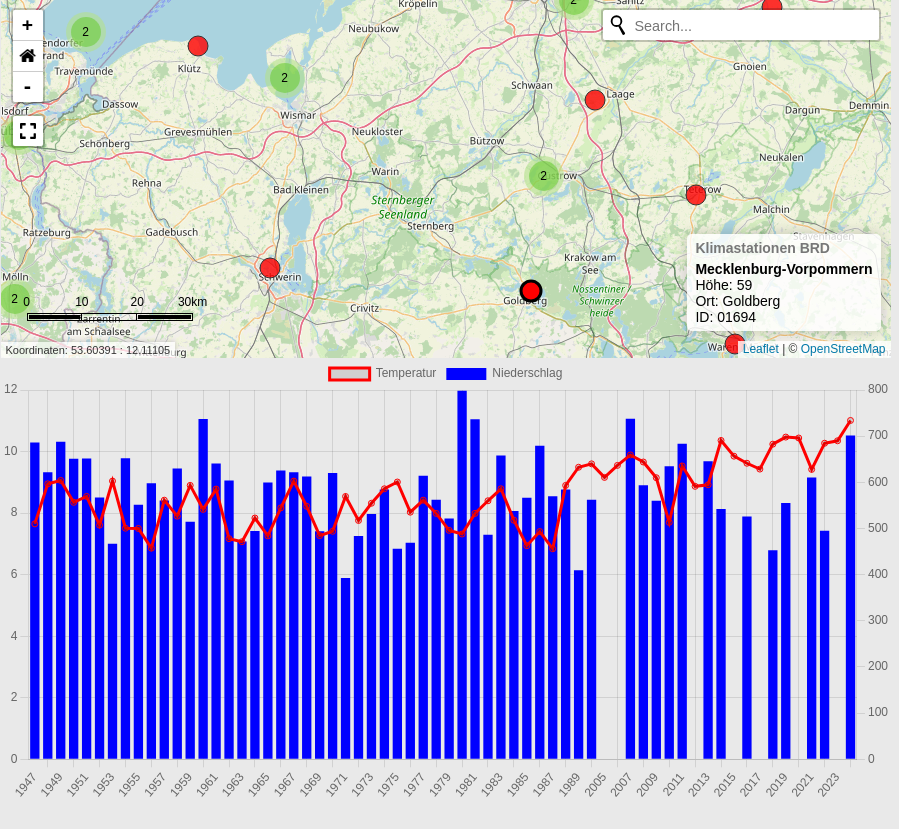

# 🌍 Klimakarte

Visualisierung von Klimadaten auf einer interaktiven Karte mit Leaflet, MarkerCluster und Chart.js.

## 📊 Datenquelle

**Deutscher Wetterdienst (DWD)**  
Die verwendeten Klimadaten stammen aus dem Open Data Portal des DWD:

🔗 [DWD Open Data – Historische Jahreswerte](https://opendata.dwd.de/climate_environment/CDC/observations_germany/climate/annual/kl/historical/)

- **Inhalt**: Historische Jahreswerte (Temperatur, Niederschlag etc.) von Wetterstationen in Deutschland  
- **Format**: CSV-Dateien, strukturiert nach Stationen  
- **Aktualisierung**: Unregelmäßig, abhängig von Datenverfügbarkeit  
- **Lizenz**: Frei verfügbar unter den Open Data Bedingungen des DWD

---

## Dependencies

| Bibliothek / Plugin              | CDN-Link                                                                 |
|----------------------------------|--------------------------------------------------------------------------|
| Leaflet                          | [Leaflet@1.9.4](https://unpkg.com/leaflet@1.9.4)                          |
| Leaflet.markercluster            | [MarkerCluster@1.5.3](https://unpkg.com/leaflet.markercluster@1.5.3)     |
| Leaflet.Control.Geocoder         | [Geocoder](https://unpkg.com/leaflet-control-geocoder)                   |
| Leaflet.GraphicScale             | [GraphicScale](https://cdn.jsdelivr.net/npm/leaflet-graphicscale)        |
| Leaflet.MousePosition            | [MousePosition@1.0.3](https://unpkg.com/leaflet-mouse-position@1.0.3)    |
| Leaflet.ZoomHome                 | [ZoomHome](https://cdn.jsdelivr.net/npm/leaflet.zoomhome)                |
| Leaflet.Fullscreen               | [Fullscreen](https://cdn.jsdelivr.net/npm/leaflet.fullscreen)            |
| Leaflet.Hash                     | [Hash](https://cdn.jsdelivr.net/npm/leaflet-hash)                        |
| Chart.js                         | [Chart.js](https://cdn.jsdelivr.net/npm/chart.js)                        |
| jQuery                           | [jQuery 3.7.1](https://cdnjs.cloudflare.com/ajax/libs/jquery/3.7.1/jquery.min.js) |
| Font Awesome                     | [Font Awesome 4.7.0](https://cdnjs.cloudflare.com/ajax/libs/font-awesome/4.7.0/css/font-awesome.min.css) |

---

## 📋 Funktionen

- 🗺️ **Interaktive Karte** mit Leaflet  
- 📍 **Marker-Clustering** für bessere Übersicht  
- 🔍 **Geocoding** zur Standortsuche  
- 📊 **Diagramme** mit Chart.js zur Visualisierung von Messwerten  
- 🎨 **Individuelles Styling** via CSS  
- 🔄 **Dynamisches Laden von Daten** mit jQuery und AJAX

---

## 🖼️ Screenshot



📌 *Beispielansicht der interaktiven Karte mit Marker-Clustering und eingeblendeten Diagrammen.*

---

## 🗂️ Projektstruktur

```plaintext
./
├── docker-compose.yml
├── logs
├── processed
│   ├── measurements
│   └── stations
├── README.MD
├── screenshot.png
├── updater
│   ├── clearStationen.py
│   ├── createArray4DataNames.py
│   ├── createGEOJSON.py
│   ├── Dockerfile
│   ├── requirements.txt
│   └── update.sh
└── web
    ├── default.conf
    ├── Dockerfile
    └── site
        ├── css
        │   └── style.css
        ├── index.html
        └── js
            ├── array4DataNames.js
            ├── chartHandler.js
            ├── ConvKlimaStat.geojson
            ├── ConvKlimaStat.js
            ├── iso8601.min.js
            ├── mapInit.js
            └── stationHandlers.js
```
